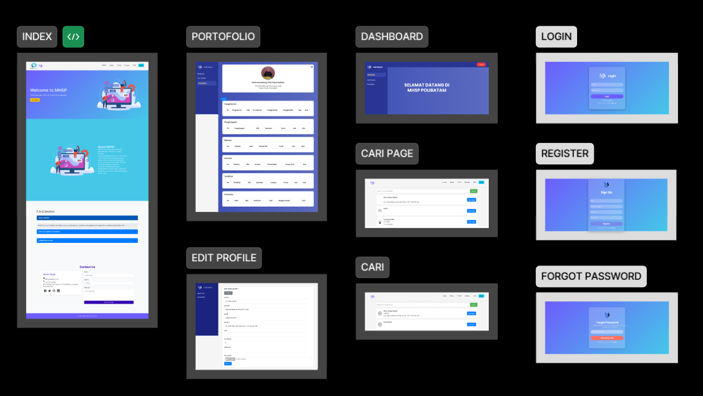

# Annisa Nabila
Batam, ID
annisanabilaandrint@gmail.com

### Description
First-year Software Engineering student at Politeknik Batam :) Learning something new every day!🌸

### Education
State Senior High School 20 Batam - Social Sciences (2021-2024)

### Technical Skills
Programming languages: Learning Python, HTML, PHP
Design tools: Skilled in Figma and Canva
Database Management: Learning MySQL
### Soft Skills
Strong communication skills
Public Speaking
Adaptability 
Creativity

### Past Projects
First Semester – Online Portfolio Website
Developed a web-based portfolio platform for Polibatam students, similar to LinkedIn or Facebook, to showcase their skills and experiences.

